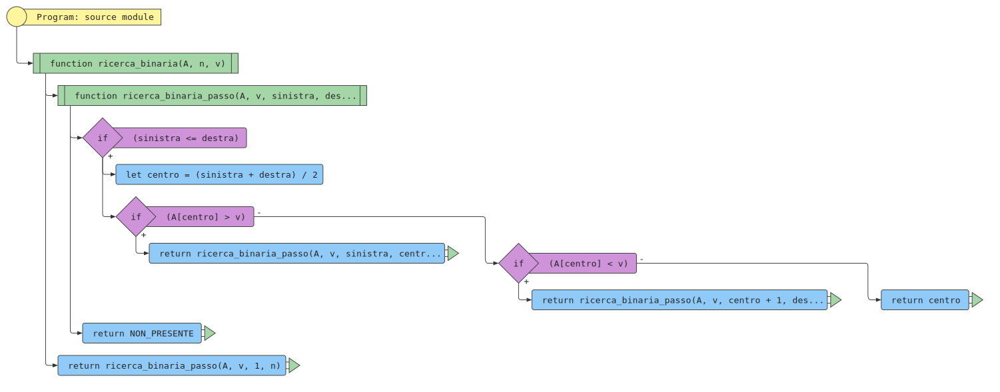

# Ricerca binaria

## Problema

Determinare se un valore  \\( v \\) dato è presente in una sequenza
**ordinata**  \\( A \\)  di  \\( n \\) valori. Se il valore  \\( v \\) è presente,
restituirne la posizione.

Una sequenza si dice ordinata se, per ogni coppia di valori adiacenti, quello di sinistra è
non maggiore di quello di destra.
Formalmente, una sequenza \\( A = [a_1, a_2, \\ldots, a_n] \\) è ordinata se
\\( a_i \\leq a\_{i+1} \\) per \\( i = 1, 2, \\ldots, n - 1 \\).

### Input

Una sequenza ordinata \\( A \\) di \\( n \\) valori, \\( A = \[a_1, a_2, \ldots, a_n\] \\) e un valore \\( v \\).

### Output:

Un indice \\( i \\) tale che l'elemento in posizione \\( i \\)-esima
della sequenza, \\( a_i \\) sia uguale a \\( v \\), oppure un valore
speciale che indica che \\( v \\) non compare nella sequenza \\( A \\).

### Esempio

#### Input

La sequenza \\(A = [1, 2, 3, 5, 7, 11, 13, 17] \\) di \\( n = 8 \\) elementi e il valore \\( v = 5 \\)

#### Output

L'indice \\( i = 4 \\) tale che \\( a_4 \\) è l'elemento \\( 5 \\).

## Algoritmo di ricerca binaria

L'algoritmo di ricerca binaria consiste cercare un dato valore al centro
di un intervallo che potrebbe includerlo. Se il valore dato è al centro,
allora restituisce l'indice, altrimenti se il valore cercato è minore del
valore nel centro ripete la ricerca nella sotto-sequenza a sinistra del centro,
altrimenti nella sotto-sequenza di destra.

## Realizzazione iterativa

### In pseudo-codice

<pre><code class="pseudo" algo="ricerca_binaria_iterativa"></code></pre>

### Come diagramma di flusso (di esecuzione)

<!---->

### In JavaScript

<pre><code class="javascript" algo="ricerca_binaria_iterativa"></code></pre>

### In Python

<pre><code class="python" algo="ricerca_binaria_iterativa"></code></pre>

#### Traccia dell'esecuzione

 

## Realizzazione ricorsiva

### In pseudo-codice

<pre><code class="pseudo" algo="ricerca_binaria_ricorsiva"></code></pre>

### Come diagramma di flusso

### In JavaScript

<pre><code class="javascript" algo="ricerca_binaria_ricorsiva"></code></pre>

### In Python

<pre><code class="python" algo="ricerca_binaria_ricorsiva"></code></pre>

#### Traccia dell'esecuzione

 

## Complessità

### Caso migliore

Numero confronti: 1

### Caso peggiore

Numero confronti: \\( p \\) tale che \\( 2^{p-1} \< n \\leq 2^p \\)

### Caso medio

Numero confronti:  \\( p \\) tale che \\( 2^{p-1} \< n \\leq 2^p \\)
