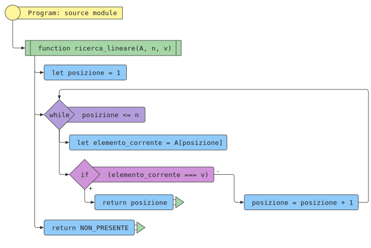
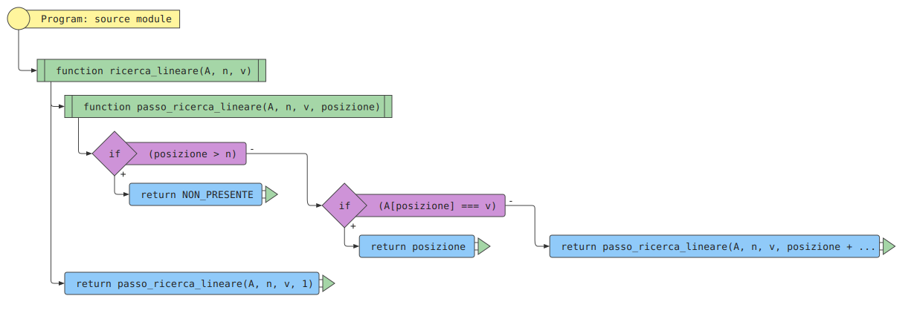

# Ricerca lineare

## Indice

[[toc]]

## Problema

Determinare se un valore \\( v \\) dato è presente in una sequenza \\( A \\) di \\( n \\) valori. Se il valore \\( v \\) è presente, restituirne la posizione.

### Input

Una sequenza \\( A \\) di \\( n \\) valori, \\( A = \[a_1, a_2, \ldots, a_n\] \\) e un valore \\( v \\).

### Output

Un indice \\( i \\) tale che l'elemento in posizione \\( i \\)-esima
della sequenza, \\( a_i \\) sia uguale a \\( v \\), oppure un valore
speciale che indica che \\( v \\) non compare nella sequenza \\( A \\).

### Esempio

#### Input

La sequenza \\(A = [5, 1, 4, 2, 3] \\) di \\( n = 5 \\) elementi e il valore \\( v = 2 \\)

#### Output

L'indice \\( i = 4 \\) tale che \\( a_4 \\) è l'elemento \\( 2 \\).

## Algoritmo di ricerca lineare

L'algoritmo di ricerca lineare consiste nella scansione dei valori della
sequenza, partendo dal primo elemento e terminando o quando si incontra
il valore cercato o quando la sequenza termina. Usa `NON_PRESENTE` per indicare che
il valore non è presente nella sequenza.

## Realizzazione iterativa

### In pseudo-codice

<pre><code class="pseudo" algo="ricerca_lineare_iterativa"></code></pre>

### Come diagramma di flusso (di esecuzione)

<!---->

### In JavaScript

<pre><code class="javascript" algo="ricerca_lineare_iterativa"></code></pre>

### In Python

<pre><code class="python" algo="ricerca_lineare_iterativa"></code></pre>

#### Traccia dell'esecuzione

 

## Realizzazione ricorsiva

### In pseudo-codice

<pre><code class="pseudo" algo="ricerca_lineare_ricorsiva"></code></pre>

### Come diagramma di flusso

### In JavaScript

<pre><code class="javascript" algo="ricerca_lineare_ricorsiva"></code></pre>

### In Python

<pre><code class="python" algo="ricerca_lineare_ricorsiva"></code></pre>

#### Traccia dell'esecuzione

 

## Complessità computazionale

### Caso migliore

Numero confronti: 1

### Caso peggiore

Numero confronti: \\( n \\)

### Caso medio

Numero confronti: \\( \frac{1+2+3+\cdots+n}{n} = \frac{(1+n)\cdot n}{2 \cdot n} = \frac{1+n}{2} \\)
