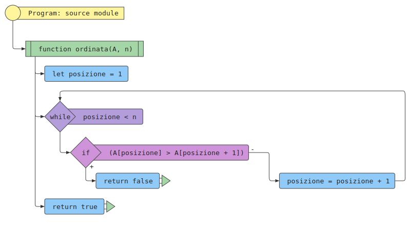
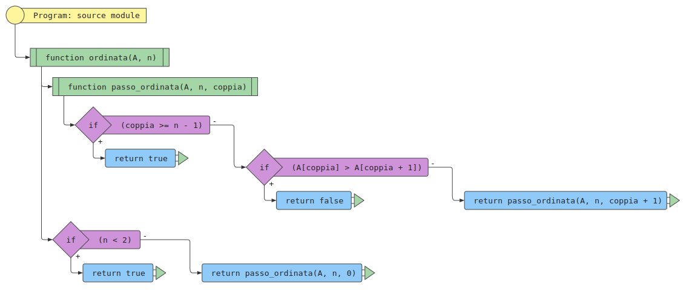

# Verifica dell'ordinamento

## Problema

Determinare se una sequenza \\( A \\) di \\( n \\) valori è ordinata (secondo una relazione d'ordine).

### Input

Una sequenza \\( A \\) di \\( n \\) valori, \\( A = \[a_1, a_2, \ldots, a_n\] \\) (e un eventuale relazione d'ordine \\( \\preccurlyeq \\)).

### Output

\\(\\mathrm{Vero}\\) se \\( a_i \\preccurlyeq a\_{i + 1} \\text{ per } i = 1, 2, \\ldots, n -
1 \\), \\(\\mathrm{Falso}\\) altrimenti.

### Esempio

#### Input

La sequenza \\(A = [1, 2, 3, 4, 5] \\) di \\( n = 5 \\) (e la relazione d'ordine \\( \\leq \\)).

#### Output

\\(\\mathrm{Vero}\\).

## Algoritmo di riconoscimento di una sequenza ordinata

L'algoritmo di riconoscimento di una sequenza ordinata consiste nella scansione delle
coppie di valori adiacenti della sequenza, partendo dalla prima coppia e terminando o
restituendo falso quando si incontra la prima coppia non ordinata, o restituendo vero
se tutte le coppie sono ordinate.

## Realizzazione iterativa

### In pseudo-codice

<pre><code class="pseudo" algo="verifica_ordinamento_iterativa"></code></pre>

### Come diagramma di flusso (di esecuzione)

### In JavaScript

<pre><code class="javascript" algo="verifica_ordinamento_iterativa"></code></pre>

### In Python

<pre><code class="python" algo="verifica_ordinamento_iterativa"></code></pre>

#### Traccia dell'esecuzione

 

## Realizzazione ricorsiva

### In pseudo-codice

<pre><code class="pseudo" algo="verifica_ordinamento_ricorsiva"></code></pre>

### Come diagramma di flusso

### In JavaScript

<pre><code class="javascript" algo="verifica_ordinamento_ricorsiva"></code></pre>

### In Python

<pre><code class="python" algo="verifica_ordinamento_ricorsiva"></code></pre>

#### Traccia dell'esecuzione

 

## Un formalismo matematico

\\( \\mathrm{ordinata?}(A) = \\begin{cases} \\text{Vero} & \\text{se }
|A| < 2\\\\ \\text{Falso} & \\text{se } a_1 \> a_2\\\\
\\mathrm{ordinata?}(A \\setminus a_1) & \\text{altrimenti} \\end{cases}
\\)

## Complessità computazionale

### Caso migliore, sequenza non ordinata

Numero confronti: 1

### Caso peggiore, caso migliore sequenza ordinata

Numero confronti: \\( n \\)
